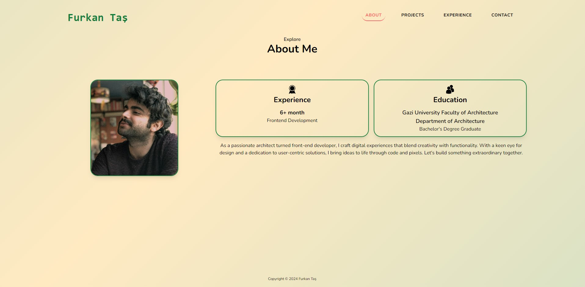

# Furkan Taş | Portfolio
Welcome to my portfolio site! This site showcases my background, projects, experience, and contact information.

🟨 **Portfolio Site Link:** <a href="https://furrkanntas.github.io/01_FT-Portfolio/index.html" target="_blank" rel="noopener noreferrer">Explore My Projects</a>

## Overview

This is the contact page of Furkan Taş's portfolio website. On this portfolio site, you can find brief information about me, view the projects I have completed in the field of front-end development, and see the education and certifications I have received. Additionally, you can find channels to contact me.

## Files

### HTML Files
- **index.html**: The main page of the portfolio site that introduces me and displays my projects.
- **about.html**: A page containing more detailed information about me.
- **experience.html**: A page showcasing my professional experience.
- **contact.html**: A page with contact information and quotes.

### CSS Files
- **styles.css**: The main stylesheet that includes custom styles for the portfolio site.
- **tailwind.css**: Tailwind CSS framework for utility-first CSS classes.

### JavaScript Files
- **navbar.js**: Script for handling the navigation menu, including the hamburger menu functionality and hover effects.

## Screenshots

## About Page (about.html)

## Projects Page (index.html)

## Experience Page (experience.html)

## Contact Page (contact.html)

## Conclusion

Thank you for visiting my portfolio site! I hope you enjoyed exploring my projects and learning more about my background in front-end development. If you have any questions or suggestions, feel free to reach out to me through the provided contact channels. Your feedback is greatly appreciated!

Best regards,  
**Furkan Taş**

🟨 **Portfolio Site Link:** <a href="https://furrkanntas.github.io/01_FT-Portfolio/index.html" target="_blank" rel="noopener noreferrer">Explore My Projects</a>